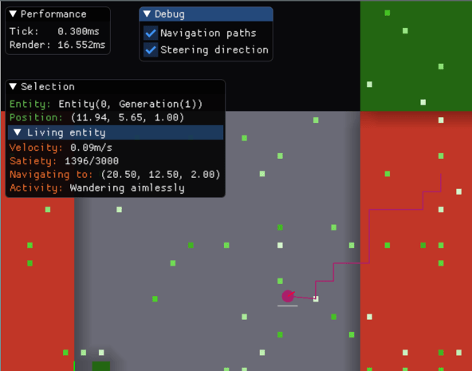
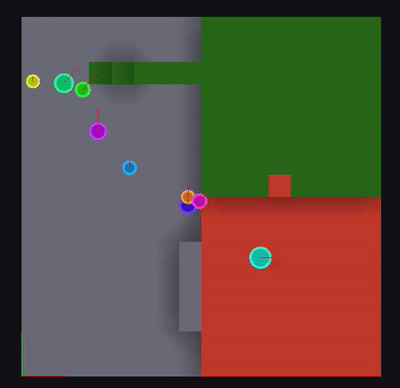
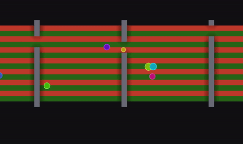

# name-needed

An effort to produce an **open source**, **intuitive** and **high performance**  Dwarf Fortress-esque game. Needs a name.

* * *

## Progress log

* 07 Jun 2020: <em>A debugging UI with imgui as an experiment in game <--> UI communication.</em>

    

* 31 May 2020: <em>AI utility system choosing between wandering, going to find food, and eating held food. Utility values are graphed in a Grafana dashboard - the need for hunger increases over time and is satisfied by sprinting to food and eating, look at them go!</em>

    

* 10 May 2020: <em>Random wandering with path finding, powered by context steering</em>

    

* 26 Apr 2020: <em>Simplified 2D graphics in a 3D world without physics</em>

    

* 31 Dec 2019: <em>Entities choosing random blocks and path finding to them, facing their direction of travel - low frame rate is to reduce GIF size, it's actually buttery smooth</em>

    

* 07 Oct 2019: <em>Multiple chunks</em>

    

* 05 Oct 2019: <em>Half steps and navmesh edge costs - blue edges are cheap walking flat/up a half step, and red edges are more expensive jumps</em>

    

* 29 Sept 2019: <em>A basic navigation mesh superimposed on an epic 3D world</em>

    

