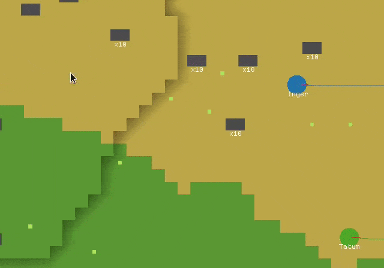
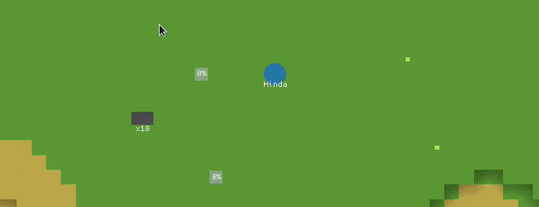
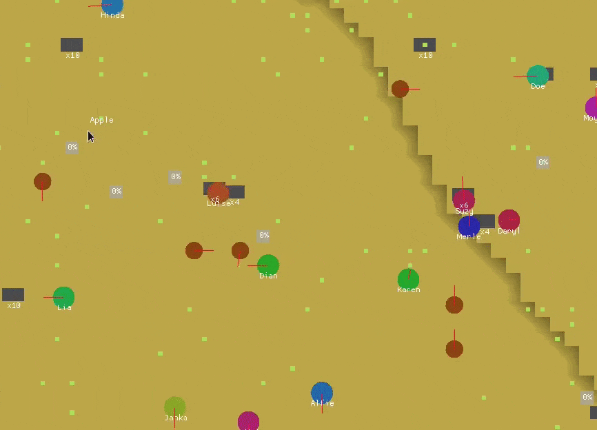

# name-needed


[](https://domwillia.ms)
[](https://github.com/XAMPPRocky/tokei)
[](https://github.com/XAMPPRocky/tokei)


A one man effort to produce an **open source**, **intuitive** and **high performance**  Dwarf Fortress-esque game. Needs a name.

* * *

## Progress log

* 25 Jan 2022: <em>A better UI for selecting entities with a dragged selection, and for issuing commands via a right-click context menu. </em>
<p style="margin: auto">
    
</p>

* 08 Jan 2022: <em>In-world text labels to show entity types and names, job progress and item stack information.</em>
<p style="margin: auto">
    
    
</p>

* 22 Dec 2021: <em>Material gathering for simple build jobs, with homogeneous item stacking. The build job (translucent square) requires 6 stone bricks, which are brought over in a stack of 5, then 1. The blue circle then uses these gathered materials to build a stone wall.</em>
<p style="margin: auto">
    
</p>

* 08 Oct 2021: <em>Major overhaul of activities (go pick this up, go break this block, etc) to use a custom async runtime for long running tasks, rather than manually implementing state machines. Activities are now much easier to write and maintain.</em>

* 16 May 2021: <em>Simple Lua scripting API.</em>
<p style="margin: auto">
    
</p>

* 02 May 2021: <em>Tree placement in forests. Trees are **very** simplistic for now, more like large mushrooms. There's a
  lot of progress behind the scenes in
  [parallel regional feature discovery](https://github.com/DomWilliams0/name-needed/blob/7c504ff0d26ecb68e0f3fae2a023e925eb0ecf04/game/procgen/src/region/regions.rs#L137),
  which will be documented in a future devlog.
  </em>
<p style="margin: auto">
    
</p>

* 29 Mar 2021: <em>Basic planet-scale biome selection based on temperature/latitude/moisture/elevation. Pictured is a 
  smooth transition between a plains and beach biome.</em>
<p style="margin: auto">
    
    
</p>

*[Continued here](PROGRESS.md)*

## Building/downloading

The engine uses SDL2 and OpenGL 3.3, and is developed primarily on Linux, although it seems to work fine on Windows too. macOS is not yet supported due to its depreciation of OpenGL.

See the [releases](https://github.com/DomWilliams0/name-needed/releases) page for prebuilt binaries - occasionally the main `develop` branch is built and published there. Download the archive for your platform, unzip and run the `name-needed` binary in that directory. On Linux, you will need to install SDL2 through your distribution's package manager first.

Otherwise you can build it with `cargo build --release` (debug builds are *really* slow). Ensure SDL2 is installed.

I use the latest stable Rust toolchain and the newest fanciest language features, so no promises for a Minimal Supported Rust Version.

```
$ git clone https://github.com/DomWilliams0/name-needed

$ cd name-needed/

$ # optionally modify game config, see below

$ cargo run --release
```

### Configuration

The game config can be found in `resources/config.ron`. This contains settings for the game engine, world generation and entity spawning parameters.

Entity definitions live in `resources/definitions/` and define the stats and capabilities of all entities, both living and inanimate.

The environment variable `NN_LOG` configures logging, set it to one of `trace`, `debug`, `info` (default), `warning`, `error`, `critical`.

The `--scenario` parameter chooses a specific situation to spawn entities in, for example people hauling things to a chest or wandering around and picking up food. Provide an invalid scenario to list all available ones (sorry, what an awful interface).


### Usage

*Note: the "game" is currently very much a demo and not very playable in the slightest. Abandon all expectations!*

* <kbd>Alt</kbd>+<kbd>Esc</kbd> to exit (most importantly)
* <kbd>Alt</kbd>+<kbd>R</kbd> to restart
* <kbd>Right-click</kbd> to drag a selection over blocks in the world
    * Then <kbd>Right-click</kbd> in the bottom right corner to build there/destroy the blocks
    * Move the selection up and down with buttons in the `World` tab
* <kbd>Left-click</kbd> (or drag) to select entities
    * Then <kbd>Right-click</kbd> a location in the world, or another entity to order them around
* <kbd>Escape</kbd> to clear the current entity and world selections
* Move the camera sideways with <kbd>WASD</kbd>, and vertically with the <kbd>Arrow keys</kbd>
