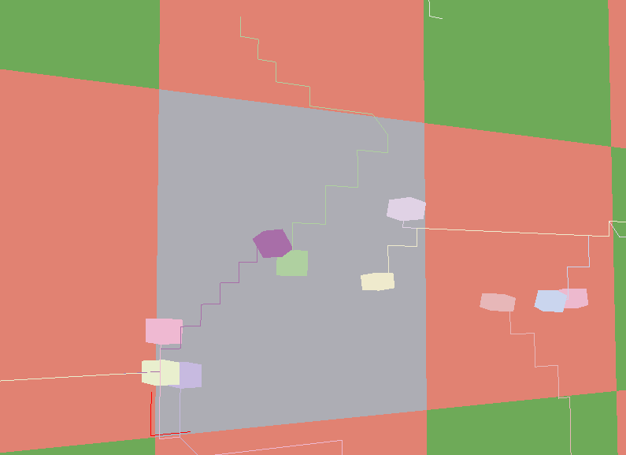
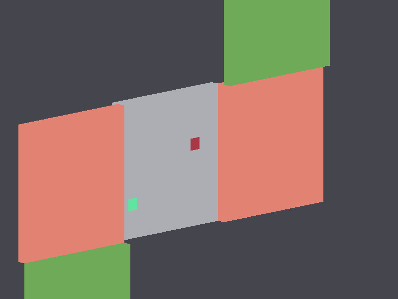
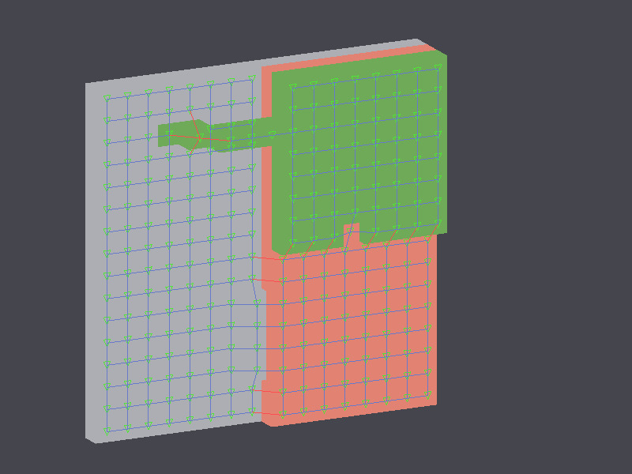
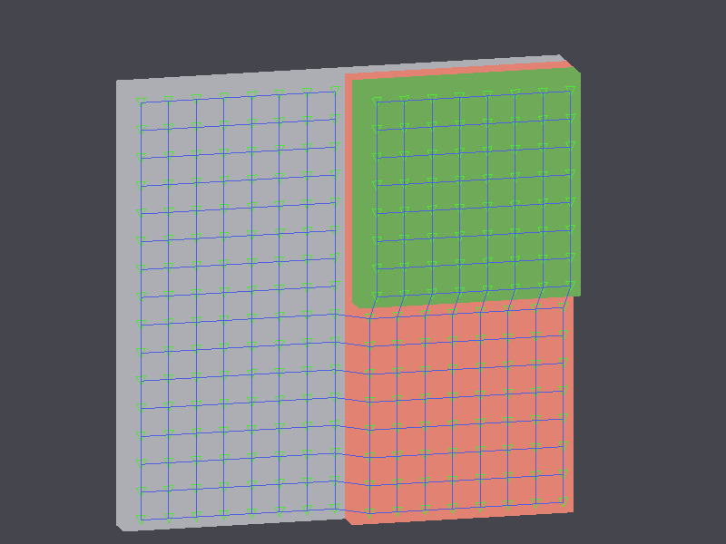

# name-needed

An effort to produce an **open source**, **intuitive** and **high performance**  Dwarf Fortress-esque game. Needs a name.

* * *

## Progress log

* 31 Dec 2019: <em>Entities choosing random blocks and path finding to them, facing their direction of travel - low frame rate is to reduce GIF size, it's actually buttery smooth</em>

    

* 07 Oct 2019: <em>Multiple chunks</em>

    

* 05 Oct 2019: <em>Half steps and navmesh edge costs - blue edges are cheap walking flat/up a half step, and red edges are more expensive jumps</em>

    

* 29 Sept 2019: <em>A basic navigation mesh superimposed on an epic 3D world</em>

    

