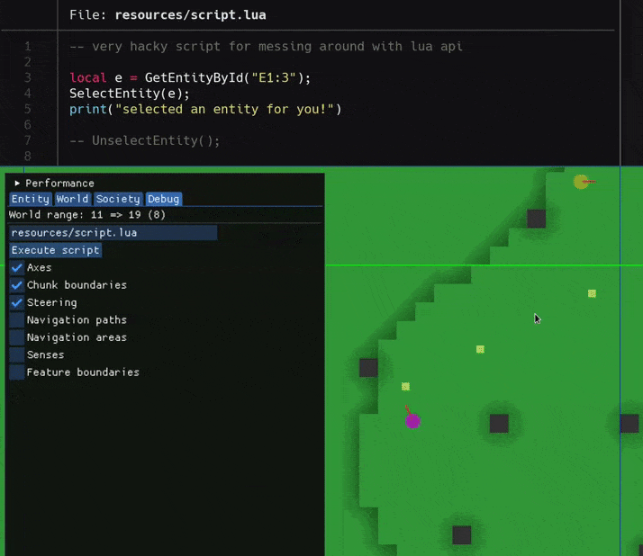
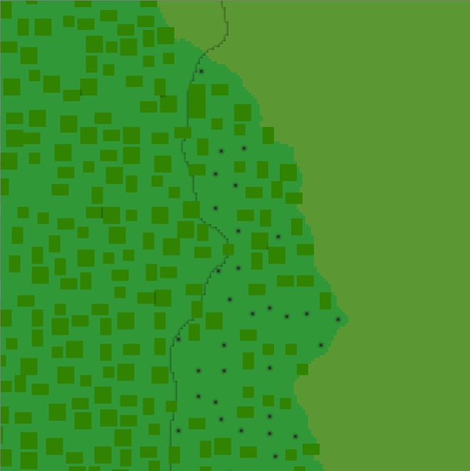
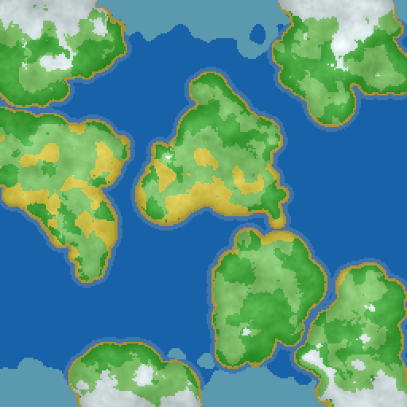
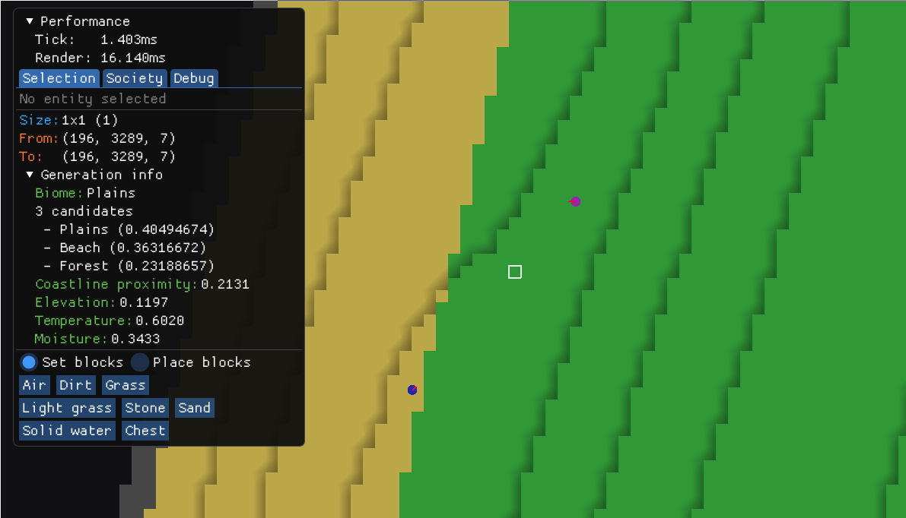

# name-needed


[](https://domwillia.ms)
[](https://github.com/XAMPPRocky/tokei)
[](https://github.com/XAMPPRocky/tokei)


A one man effort to produce an **open source**, **intuitive** and **high performance**  Dwarf Fortress-esque game. Needs a name.

* * *

## Progress log

* 08 Oct 2021: <em>Major overhaul of activities (go pick this up, go break this block, etc) to use a custom async runtime for long running tasks, rather than manually implementing state machines. Activities are now much easier to write and maintain.</em>

* 16 May 2021: <em>Simple Lua scripting API.</em>
<p style="margin: auto">
    
</p>

* 02 May 2021: <em>Tree placement in forests. Trees are **very** simplistic for now, more like large mushrooms. There's a
  lot of progress behind the scenes in
  [parallel regional feature discovery](https://github.com/DomWilliams0/name-needed/blob/7c504ff0d26ecb68e0f3fae2a023e925eb0ecf04/game/procgen/src/region/regions.rs#L137),
  which will be documented in a future devlog.
  </em>
<p style="margin: auto">
    
</p>

* 29 Mar 2021: <em>Basic planet-scale biome selection based on temperature/latitude/moisture/elevation. Pictured is a 
  smooth transition between a plains and beach biome.</em>
<p style="margin: auto">
    
    
</p>

*[Continued here](PROGRESS.md)*

## Building/downloading

The engine uses SDL2 and OpenGL, and is developed primarily on Linux, although it seems to work fine on Windows too.

See the [releases](https://github.com/DomWilliams0/name-needed/releases) page for prebuilt binaries - occasionally the main `develop` branch is built and published there. Simply download, unzip and run the binary in that directory.

Otherwise you can build it with `cargo build --release` (debug builds are *really* slow). If you don't have SDL2 installed, the [bundled](https://github.com/Rust-SDL2/rust-sdl2/blob/ed465322d137e207b03403a6f452d176ef9efda0/README.md#bundled-feature) feature of SDL can download and compile it for you (requires a C compiler).

I use the latest stable Rust toolchain and the newest fanciest language features, so no promises for a Minimal Supported Rust Version.

```
$ git clone https://github.com/DomWilliams0/name-needed

$ cd name-needed/

$ # optionally modify game config, see below

$ cargo run --release
```

### Configuration

The game config can be found in `resources/config.ron`. This contains settings for the game engine, world generation and entity spawning parameters.

Entity definitions live in `resources/definitions/` and define the stats and capabilities of all entities, both living and inanimate.

The environment variable `NN_LOG` configures logging, set it to one of `trace`, `debug`, `info` (default), `warning`, `error`, `critical`.

The `--scenario` parameter chooses a specific situation to spawn entities in, for example people hauling things to a chest or wandering around and picking up food. Provide an invalid scenario to list all available ones (sorry, what an awful interface).


### Usage

*Note: the "game" is currently very much a demo and not very playable in the slightest. Abandon all expectations!*

* <kbd>Esc</kbd> to exit (most importantly)
* <kbd>R</kbd> to restart
* <kbd>Left-click</kbd> to select an entity and view their stats in the debug menu
	* Command them to go to or break a selected block via `Divine control`
	* Select an item and order it to be hauled to the tile selection in the `Society` menu
* <kbd>Right-click</kbd> to drag a selection over blocks in the world
	* Command them to collaborate to break blocks via the `Society` menu
	* Set and place blocks via the `Selection` menu
* Move the camera sideways with <kbd>WASD</kbd>, and vertically with the <kbd>Arrow keys</kbd>
